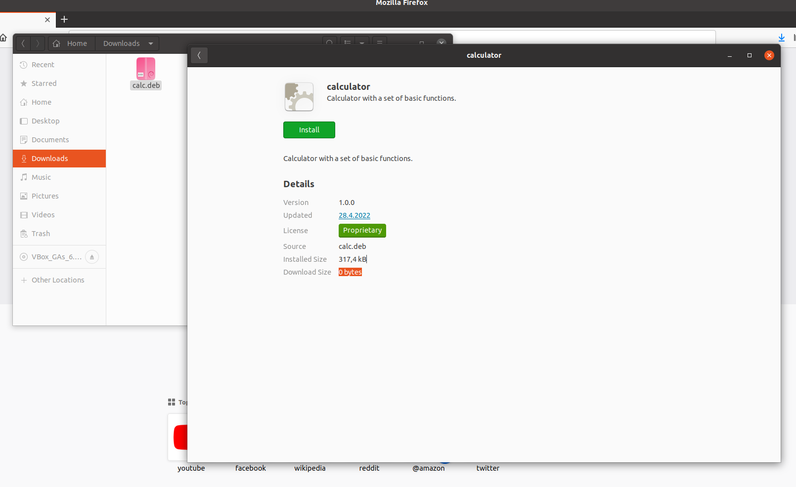
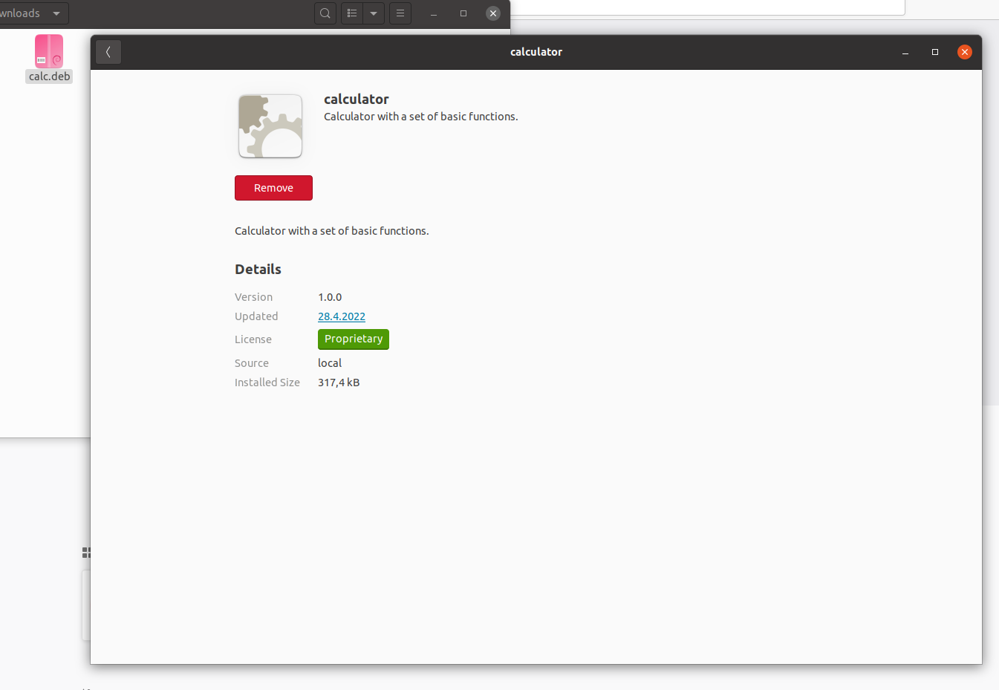

<p align="center">
    <br />
    <b>Kalkulačka</b>
</p>

# Instalace

## Podporovaná prostředí

Program podporuje pouze operační systém Ubuntu 64bit.

## Stáhnutí balíčku

Aktuální ``calc.deb`` můžete stáhnout v [releases](https://github.com/Wertik/ivs-proj-02/releases).

## Instalace pomocí Ubuntu Software Install

Menu pro instalaci otevřete dvojklikem na soubor, případně pravým kliknutím a zvolením možnosti ``Open with Software Install``.


Po kliknutí na ``Install`` se aplikace nainstaluje.

## Instalace přes terminál

Ve složce se souborem ``calc.deb`` pomocí příkazu:
```
sudo dpkg -i calc.deb
```

---
Po dokončení instalace se aplikace objeví v ``Applications`` menu. \


# Odinstalace

## Package manager (UI)

### Přes balíček

Opakovaným otevřením instalačního menu přes debian balíček se dá aplikace opět odinstalovat.


Po kliknutí na ``Remove`` se aplikace odinstaluje.

### Přes správce aplikací Ubuntu Software

Otevřete aplikaci ubuntu software pro správu aplikací.
V záložce "Installed" najděte aplikaci ``calculator`` a klikněte na ``Remove``.


## Package manager (terminál)

V terminálu pomocí příkazu
```
sudo apt-get remove calculator
```

## Manuálně

Manuální vymazání všech souborů spojených s aplikací:
```
rm /usr/local/bin/calc
rm /usr/share/applications/calc.desktop
rm /opt/calc/calc.png
```

# Sestavení ze zdroje

## Požadavky

Sestavení je možné pouze na platformě linux.

Jsou nutné apt balíčky ``make, cmake, g++, qt5-default``.

Příkaz pro instalaci balíčků:
```
sudo apt install make
sudo apt install cmake
sudo apt install g++
sudo apt install qt5-default
```
---

Stažení zdrojových kódů
```
git clone https://github.com/Wertik/ivs-proj-02.git
```
---

Přesunutí do složky s Makefile
```
cd ivs-proj-02/src/
```
---

Přeložení
```
make all
```

Spustitelný soubor ``calc`` se vytvoří ve složce ``build/``. \
Aplikaci rovnou spustíte příkazem ```make run```.

# Vytvoření debian balíčku (.deb)

Nejdříve je nutné aplikaci [sestavit](#sestavení-ze-zdroje).

Vytvoření balíčku
```
make install
```
Vytvoří balíček ``calc.deb`` ve složce ``packages/``

# Klávesové zkratky

| Zkratka | Akce |
| -- | -- |
| Num 0 | 0 |
| Num 1 | 1 |
| Num 2 | 2 |
| Num 3 | 3 |
| Num 4 | 4 |
| Num 5 | 5 |
| Num 6 | 6 |
| Num 7 | 7 |
| Num 8 | 8 |
| Num 9 | 9 |
| / | / |
| * | * |
| - | - |
| + | + |
| Enter | = |
| , (del) | , |
| Šipka vlevo | ( |
| Šipka vpravo | ) |
| Šipka nahoru | x<sup>y</sup> |
| Šipka dolu | √ |
| Ctrl + C | Zkopírovat obsah displaye |
| Delete | Vymázání displaye |

# Autoři

CMYK Team

| Login | Jméno | Github |
|--|--|--|
| xkucik00 | Kučík Adam | [@Adam-K2](https://github.com/Adam-K2) |
| xotrad00 | Otradovec Martin | [@Wertik](https://github.com/Wertik) | 
| xskund02 | Škunda Jakub | [@jakubskunda](https://github.com/jakubskunda) |
| xvince01 | Vincenc Lukáš | [@gunter-dev](https://github.com/gunter-dev) |

# Návrh UI a mockup budoucí verze

Figma: https://www.figma.com/file/T5BqQWrPt3MQ4FjbT0GfVf/IVS-project-2?node-id=0%3A1

# Licence

Tento program je poskytován pod licencí [GNU General Public License v3.0](LICENSE).
